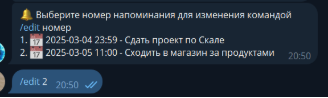

Telegram bot notify

Телеграм бот напоминалка, с помощью которого можно создавать и редактировать напоминания, которые будут приходить пользователю в телеграм бота

Тег в телеграме - @Scala\_notify\_me\_bot

Если необходимо могу поднять бота в любой момент

Бот использует Telegramium для работы с api телеграмма и Doobie для работы с базой данных

Функионал

Команда /start выводит кликабельное меню возможных действий

Добавить напоминание:

Команда /remind YYYY-MM-DD HH:MM ТЕКСТ

Активные напоминание:

Удалить напоминание:

Команда /delete номер

Изменить напоминание:

Команда /edit номер

